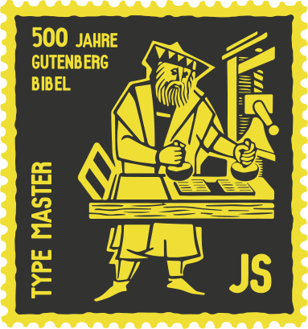

A curated collection of javascript resources about web typography

* [General](#general)
* [Hypenation](#hypenation)
* [Widows](#widows)
* [Ellipsis](#ellipsis)
* [Wrap around](#wrap-around)
* [Kerning](#kerning)
* [Vertical rhythm](#vertical-rhythm)
* [Fitting Text](#fitting-text)
* [Responsive](#responsive)
* [Individual sentence/word/letter Control](#individual-sentencewordletter-control)
* [Side & footnotes](#side--footnotes)
* [User text selection](#user-text-selection)
* [Transform Text](#transform-text)
* [Other Special Effects](#other-special-effects)

##General

####Typography.js
This is a small project that simply brings together several useful JavaScript functions.
[https://github.com/elliottcable/typography.js](https://github.com/elliottcable/typography.js)

####Font.js
This library adds a Font object to the collection of predefined objects available to you when doing JS coding for the web.   
[http://pomax.nihongoresources.com/pages/Font.js/](http://pomax.nihongoresources.com/pages/Font.js/)

####Typesetter.js
an open source project with the goal of bringing better typography to every type of digital screen    
[https://github.com/nofont/Typesetter.js](https://github.com/nofont/Typesetter.js)

####typogr.js
provides a set of functions which automatically apply various transformations to plain text in order to yield typographically-improved HTML.    
[https://github.com/ekalinin/typogr.js](https://github.com/ekalinin/typogr.js)

####Calzone
Better typesetting for EPUB (and HTML).		
[https://github.com/simoncozens/calzone](https://github.com/simoncozens/calzone)

##Hypenation:

####TeX line breaking algorithm in JavaScript.		
[https://github.com/bramstein/typeset](https://github.com/bramstein/typeset)

####Hypher
A small and fast JavaScript hyphenation engine. Can be used in Node.js and as a jQuery plugin.
[https://github.com/bramstein/Hypher](https://github.com/bramstein/Hypher)

####BalanceText
A jQuery plugin to provide an alternate text wrapping algorithm.   
[https://github.com/adobe-webplatform/balance-text](https://github.com/adobe-webplatform/balance-text)

##Widows:

####The Widow Tamer
…is a Javascript to automatically fix typographic widows on your web pages.
[https://github.com/nathanford/widowtamer](https://github.com/nathanford/widowtamer)

####typorphanage
A simple jQuery script for managing typographic orphans & widows as programmatically as possible.
[https://github.com/Nilloc/typorphanage](https://github.com/Nilloc/typorphanage)

##Ellipsis:

####trunk8
jQuery Truncation Plugin based on n.° of lines.   
[https://github.com/rviscomi/trunk8](https://github.com/rviscomi/trunk8)

Zepto version   
[https://github.com/etouches/trunk8-zepto](https://github.com/etouches/trunk8-zepto)

####Ellipsis
Ellipsis is a customizable jQuery plugin for the smart truncation of text base on container width and not character count.   
[https://github.com/kanikarphan/ellipsis](https://github.com/kanikarphan/ellipsis)

####Clamp.js
Clamps an HTML element by adding ellipsis to it if the content inside is too long.
[https://github.com/josephschmitt/Clamp.js](https://github.com/josephschmitt/Clamp.js)

####jQuery.dotdotdot
an advanced cross-browser ellipsis for multiple line content plugin.   
[http://dotdotdot.frebsite.nl/](http://dotdotdot.frebsite.nl/)

####TextTailor.js   
Tailor-made text to fit your needs! Responsive text to fill the height of the parent element or ellipse it when it doesn't fit.      
[http://jpntex.com/texttailor/](http://jpntex.com/texttailor/)

##Wrap around:

####jQSlickWrap
the pixel-perfect prose plugin.   
[https://github.com/jasonwyatt/jQSlickWrap](https://github.com/jasonwyatt/jQSlickWrap)

####Bacon!
a jQuery plugin that allows you to wrap text around a bezier curve or a line.   
[https://github.com/hudsonfoo/jQuery-Bacon](https://github.com/hudsonfoo/jQuery-Bacon)

##Kerning

####kern.js
A super-simple bookmarklet for designers that finally puts you back in control of your website's typography.   
[http://www.kernjs.com/](http://www.kernjs.com/)

####jKerny
kerning get easy.   
[https://github.com/clearideaz/jKerny](https://github.com/clearideaz/jKerny)

####TypeButter
allows you to set optical kerning for any font on your website.   
[http://typebutter.com/](http://typebutter.com/)

####Kerning.js
take control of your web typography   
[https://github.com/endtwist/kerning.js](https://github.com/endtwist/kerning.js)

##Vertical rhythm

####mini-rhythm.js
Pure JavaScript way of keeping elements adhering to a vertical rhythm.
Around 561 bytes. Not dependant on jQuery. cross browser compatibility (**IE7** onwards).
Intended to accompany CSS vertical rhythm – not replace it!    
[https://github.com/RShergold/mini-rhythm.js](https://github.com/RShergold/mini-rhythm.js)    

####Auto line-height
a jQuery plugin for flexible layouts.   
[http://www.ollicle.com/2007/jun/03/jquery_lineheight_flexible.html](http://www.ollicle.com/2007/jun/03/jquery_lineheight_flexible.html)

####Line In Typography   
[https://github.com/SimonFairbairn/Line-In-Typography](https://github.com/SimonFairbairn/Line-In-Typography)

####jMetronome   
Using jQuery to keep typographic rhythm.      
[http://www.fortes.com/2008/jmetronome-using-jquery-to-keep-typographic-rhythm](http://www.fortes.com/2008/jmetronome-using-jquery-to-keep-typographic-rhythm)

####Baseline.js
Baseline.js is a simple jQuery plugin for restoring baselines thrown off by odd image sizes.   
[https://github.com/daneden/Baseline.js](https://github.com/daneden/Baseline.js)

##Fitting Text

####FitText.js
a jQuery plugin for inflating web type.   
[https://github.com/davatron5000/FitText.js](https://github.com/davatron5000/FitText.js)

####jSlabify
a jQuery plugin for creating slabbed typography.   
[https://github.com/gschoppe/jSlabify](https://github.com/gschoppe/jSlabify)

####BigText
jQuery plugin   
[https://github.com/zachleat/BigText](https://github.com/zachleat/BigText)

####Hatchshow
is a jQuery typesetting plugin. it balances measures.   
[http://charliepark.org/hatchshow/](http://charliepark.org/hatchshow/)

####Slabtext
a jquery plugin for producing big, bold & responsive headlines.   
[https://github.com/freqDec/slabText/](https://github.com/freqDec/slabText/)

####TextTailor.js   
Tailor-made text to fit your needs! Responsive text to fill the height of the parent element or ellipse it when it doesn't fit.      
[http://jpntex.com/texttailor/](http://jpntex.com/texttailor/)

####jQuery responsiveText
A jQuery plugin to set font sizes responsively based on its' container width. Use jQuery responsiveText to have scalable headlines, build responsive tables and more!    
[https://github.com/ghepting/jquery-responsive-text](https://github.com/ghepting/jquery-responsive-text)

####textFit v2.1.0
A fast, jQuery-free text sizing component that quickly fits single and multi-line text to the width (and optionally height) of its container.   
[https://github.com/STRML/textFit](https://github.com/STRML/textFit)

####Squishy.js
Squishy is a jQuery plugin that automatically resizes text to exactly fit the container with no extra work on your part.   
[http://cmsauve.com/projects/squishy/](http://cmsauve.com/projects/squishy/)

####jQuery TextFill
This jQuery plugin resizes text to make it fit into a container. The font size gets as big as possible.    
[https://github.com/jquery-textfill/jquery-textfill](https://github.com/jquery-textfill/jquery-textfill)

####WideText 
A lightweight jQuery plugin that allows your to create full width text elements that will resize according to the browser window.      
[https://bitbucket.org/cbavota/widetext/](https://bitbucket.org/cbavota/widetext/)

####textStretch.js
A javascript function and a jQuery extension for maximizing font sizes to fill out the element's width.   
textStretch.js is minimal, fast and robust. It doesn't require or add any wrappers or child-elements, and it adapts to when you resize the window or flip your device. t**extStretch is build with older browsers in mind. It's tested and works with Chrome, Safari, Firefox and Internet Explorer (I haven't tested any version older than 6 though).**    
[https://github.com/friday/textStretch.js](https://github.com/friday/textStretch.js)

####Font-to-Width
Font-To-Width if a small Javascript routine which fits text to the width of an element using multiple font families of different widths.   
[https://github.com/chrissam42/font-to-width](https://github.com/chrissam42/font-to-width)

####Fitter Happier Text
Performant, fully fluid headings    
[http://jxnblk.github.io/fitter-happier-text/](http://jxnblk.github.io/fitter-happier-text/)

##Responsive

####Responsive-Measure
A jQuery plugin for generating a responsive ideal measure.
[https://github.com/jbrewer/Responsive-Measure](https://github.com/jbrewer/Responsive-Measure)

####jQuery.responsiveText
A simple jQuery plugin to make a specific selector's or the whole page's text responsive.
[https://github.com/klr/jQuery.responsiveText](https://github.com/klr/jQuery.responsiveText)

####FlowType.JS
Responsive web typography at its finest: font-size and line-height based on element width.    
[http://simplefocus.com/flowtype/](http://simplefocus.com/flowtype/)

####jQuery.fontFlex
Lightweight jQuery extension for dynamically changing font sizes according to screen / browser width. Intended to be used with responsive or adaptive CSS layouts.    
[https://github.com/NathanRutzky/jQuery.fontFlex](https://github.com/NathanRutzky/jQuery.fontFlex)

##Individual sentence/word/letter Control

####Lettering.js
a jQuery plugin for radical Web Typography.    
[https://github.com/davatron5000/Lettering.js](https://github.com/davatron5000/Lettering.js)

####Blast.js
Blast.js separates text in order to facilitate typographic manipulation. It has four delimiters built in: character, word, sentence, and element. Alternatively,Blast can match custom regular expressions and phrases.    
[http://julian.com/research/blast/](http://julian.com/research/blast/)

##Side & footnotes

####SideComments.js
A sweet-ass interface component to give your site Medium.com style comments.    
[http://aroc.github.io/side-comments-demo/](http://aroc.github.io/side-comments-demo/)

####Footnoted
Make superscript footnote markers with scrolling anchor links to a footnote section.    
[https://github.com/jheftmann/footnoted](https://github.com/jheftmann/footnoted)

####Bigfoot
A jQuery plugin for empowering footnotes.    
[http://www.bigfootjs.com/](http://www.bigfootjs.com/)

####jQuery.sidenotes
Transform Markdown footnotes into superpowered1 sidenotes.    
[http://acdlite.github.io/jquery.sidenotes/](http://acdlite.github.io/jquery.sidenotes/)

####jquery inline footnotes
jQuery plugin to create inline plugins from Markdown-created HTML footnotes.    
[https://github.com/oncomouse/jquery-inline-footnotes](https://github.com/oncomouse/jquery-inline-footnotes)

####Responsive Sidenotes [Tutorial]
Footnotes and sidenotes are both useful ways to annotate online blog posts and articles. With the help of responsive design, it's now possible to use both approaches at the same time.    
[http://johndjameson.com/blog/responsive-sidenotes/](http://johndjameson.com/blog/responsive-sidenotes/)

####Foot2Side
a tiny jQuery script that transforms footnotes into sidenotes and align them vertically with their references.
[https://github.com/metaphox/footnote-to-sidenote](https://github.com/metaphox/footnote-to-sidenote)

##User text selection

####Selection sharer
Medium like popover menu to share on Twitter or by email any text selected on the page.    
[https://github.com/xdamman/selection-sharer](https://github.com/xdamman/selection-sharer)

####SelectText.js
SelectText.JS: Highlight, Share, and Copy the text your users want.    
[https://github.com/ptariche/selectText.js](https://github.com/ptariche/selectText.js)

####Annotatorjs
Annotator is an open-source JavaScript library to easily add annotation functionality to any webpage. Annotations can have comments, tags, links, users, and more. Annotator is designed for easy extensibility so its a cinch to add a new feature or behaviour.    
[http://annotatorjs.org/](http://annotatorjs.org/)

####selectionmenu
JavaScript context menu for selected text; Insert a source reference in copied text.    
[https://github.com/molily/selectionmenu](https://github.com/molily/selectionmenu)

##Transform Text

####Simple Text Rotator
Add a super simple rotating text to your website with little to no markup.    
[https://github.com/peachananr/simple-text-rotator](https://github.com/peachananr/simple-text-rotator)

####Morphext
A simple, high-performance and cross-browser jQuery rotating / carousel plugin for text phrases powered by Animate.css.    
[https://github.com/MrSaints/Morphext](https://github.com/MrSaints/Morphext)

####Textualizer
a jQuery plug-in that allows you to transition through blurbs of text.
[https://github.com/krisk/textualizer](https://github.com/krisk/textualizer)

####JQuery ShuffleText Plugin
JQuery Shuffle Text is a lightweight JQuery plugin able to shuffle any of your text content. Easy to use, it offers a set of options to customize it...    
[https://github.com/Anthodpnt/JQuery-ShuffleText-Plugin](https://github.com/Anthodpnt/JQuery-ShuffleText-Plugin)

####Shuffle Letters Effect
a jQuery Plugin.    
[http://tutorialzine.com/2011/09/shuffle-letters-effect-jquery/](http://tutorialzine.com/2011/09/shuffle-letters-effect-jquery/)

####funnyText.js
Create funny and crazy moving texts in a simple way.   
[https://github.com/alvarotrigo/funnyText.js](https://github.com/alvarotrigo/funnyText.js)

####Airport
jqQery plugin which emulates the style of those flickering information boards.   
[http://www.unwrongest.com/projects/airport/](http://www.unwrongest.com/projects/airport/)

##Other Special Effects

####Textillate
A simple plugin for CSS3 text animations.   
[http://jschr.github.io/textillate/](http://jschr.github.io/textillate/)

####Web Typography for the Lonely
[http://webtypographyforthelonely.com/](http://webtypographyforthelonely.com/)

####Arctext.js
curving text with css3 & jquery.
[http://tympanus.net/Development/Arctext/](http://tympanus.net/Development/Arctext/)

####TextGrad jQuery plugin
A plugin to make color gradients in texts.
[https://github.com/subtenante/TextGrad](https://github.com/subtenante/TextGrad)

####jQisotext
jquery text effect plugin.   
[https://code.google.com/p/jqisotext/downloads/list](https://code.google.com/p/jqisotext/downloads/list)

####grab bag
assorted text effects jQuery plugins   
[http://onehackoranother.com/projects/jquery/jquery-grab-bag/text-effects.html](http://onehackoranother.com/projects/jquery/jquery-grab-bag/text-effects.html)

####Creative web typography styles
[http://tympanus.net/codrops/2012/09/12/creative-web-typography-styles/](http://tympanus.net/codrops/2012/09/12/creative-web-typography-styles/)
